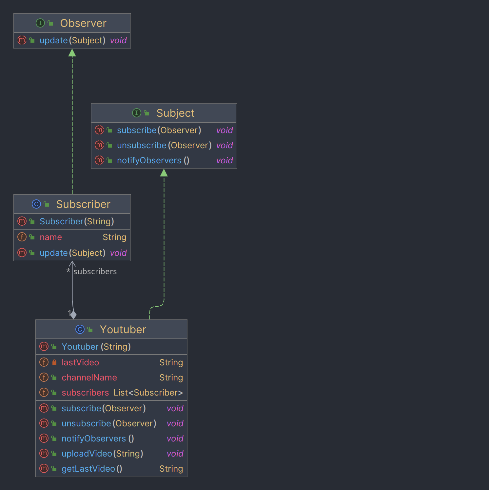
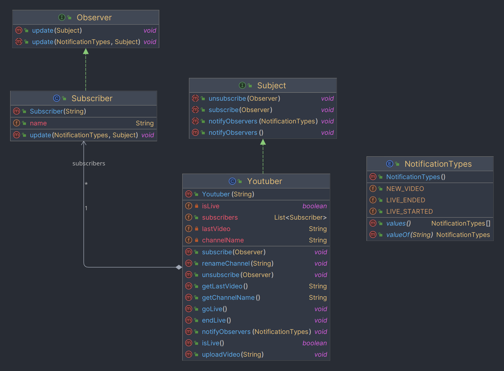
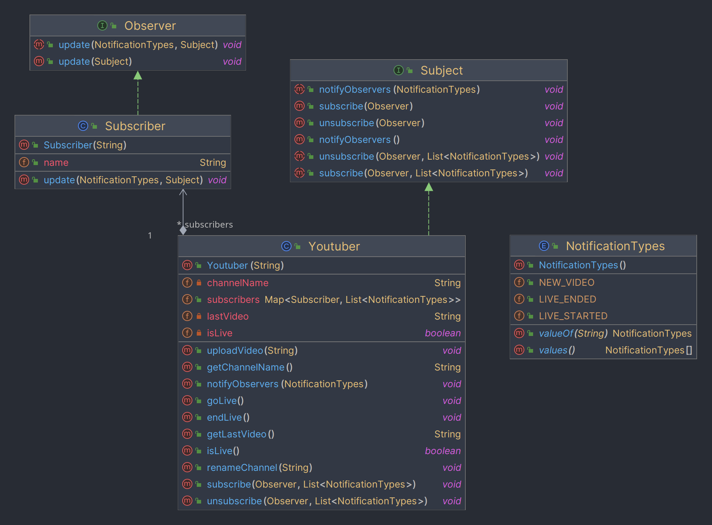

# TP - Observer Pattern

## Introduction

Vous travaillez pour Google et vous devez implémenter le système de notification pour YouTube. Vous pouvez télécharger la structure de base avec la commande suivante :
```shell
git clone https://github.com/nathanboschi25/TP_DESIGN_PATTERN_OBSERVER.git
```

## Version 1 - Bases

L'idée de base est qu'un utilisateur (`Subscrber` -> `Observer`) peut s'abonner à une chaîne (`Youtuber` -> `Subject`) et recevoir des notifications lorsqu'une nouvelle vidéo est mise en ligne.
**Pour chaque notification, le Subscriber affiche son nom et la notification.**

**Les descriptions ci-dessous ne sont pas exhaustives, les détails présentés sont ceux qui méritent une explication supplémentaire. Pour compléter le TP en entier, référez-vous au diagramme UML à la fin de cette section.**

### Subscriber

- `update(Youtuber context)` : l'action à faire lorsque le `Subject` notifie l'`Observer`. Dans ce cas, le nom de la
  vidéo est affiché.


### Youtuber

- `lastVideo` : le nom de la dernière vidéo mise en ligne.
- `suscribers` : la liste des `Observers` qui se sont abonnés au `Subject`. C'est une liste de `Subscriber`.
- `subscribe(Subscriber subscriber)` et `unsubscribe(Subscriber subscriber)` : ajoute ou retire un `Subscriber` de la
  liste des abonnés.
- `notifyObservers()` : notifie tous les abonnés qu'une nouvelle vidéo a été mise en ligne. Cela appelle la méthode `update()` de
  chaque `Subscriber`.
- `uploadVideo(String videoName)` : met en ligne une nouvelle vidéo et notifie tous les abonnés.


Vous trouverez ci-dessous le diagramme UML de la première version :


## Version 2 - Types de notifications

Dans cette version, nous voulons pouvoir émettre différents types de notifications. Pour chaque notification, cette étape nous permettra de faire différentes actions en fonction du type de notification.

**Les descriptions ci-dessous ne sont pas exhaustives, les détails présentés sont ceux qui méritent une explication supplémentaire. Pour compléter le TP en entier, référez-vous au diagramme UML à la fin de cette section.**

### NotificationTypes

`NEW_VIDEO`, `LIVE_STARTED`, `LIVE_ENDED` sont les types de notifications utilisés dans ce TP.

**Vous devez mettre à jour les méthodes `Suscriber::update()`, `Youtuber::notifyObservers()` et `Youtuber::uploadVideo()` pour prendre en compte le type de notification.**


### Youtuber

- `isLive` : un booléen qui indique si le youtuber est en live ou non.
- `goLive()` and `endLive()` : met le booléen `isLive` à `true` ou `false` et notifie les abonnés.
- `notifyObservers(NotificationTypes notificationType)` : notifie tous les abonnés d'un événement. Cela appelle la méthode `update(NotificationTypes notificationType)` de chaque `Subscriber` avec le type de notification en paramètre.

### Suscriber

- `update(Youtuber context, NotificationTypes notificationType)` : l'action à faire lorsque le `Subject` notifie
  l'`Observer`. Vous devez différencier les actions en fonction du type de notification (par exemple, afficher le nom
  de la vidéo si le type de notification est `NEW_VIDEO` et afficher "Le youtuber {nom} est en live" si le type de
  notification est `LIVE_STARTED`...)


Vous trouverez ci-dessous le diagramme UML de la deuxième version :


## Version 3 - Abonnements personnalisés

Dans cette version, nous voulons pouvoir nous abonner à différents types de notifications. Pour chaque notification, cette étape nous permettra de faire différentes actions en fonction du type de notification et d'envoyer uniquement les notifications que l'abonné souhaite recevoir.
Cette version nous force à modifier la liste des abonnés de la classe `Youtuber`. C'est maintenant une map : `Map<Suscriber, List<NotificationTypes>>`.

**Les descriptions ci-dessous ne sont pas exhaustives, les détails présentés sont ceux qui méritent une explication supplémentaire. Pour compléter le TP en entier, référez-vous au diagramme UML à la fin de cette section.**

### Youtuber

- `subscribe(Subscriber subscriber, List<NotificationTypes> notificationTypes)` : ajoute un `Subscriber` à la liste des
  abonnés **avec les types de notifications qu'il souhaite recevoir**.
- `notifyObservers(NotificationTypes notificationType)` : notifie tous les abonnés d'un événement. Cela appelle la méthode `update(NotificationTypes notificationType)` de chaque `Suscriber` qui souhaite recevoir ce type de notification.

Vous trouverez ci-dessous le diagramme UML de la troisième version :


